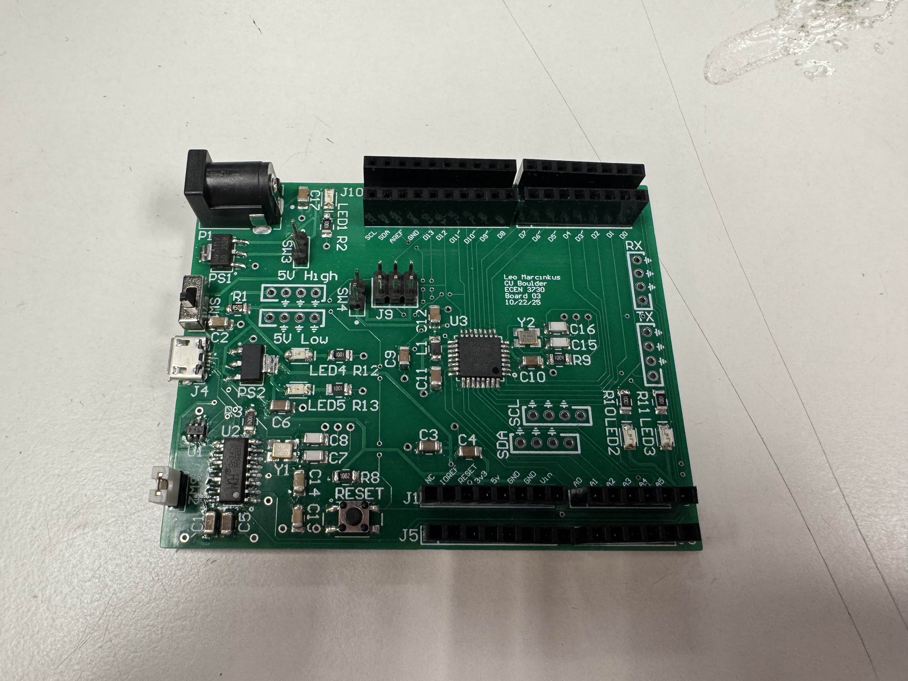
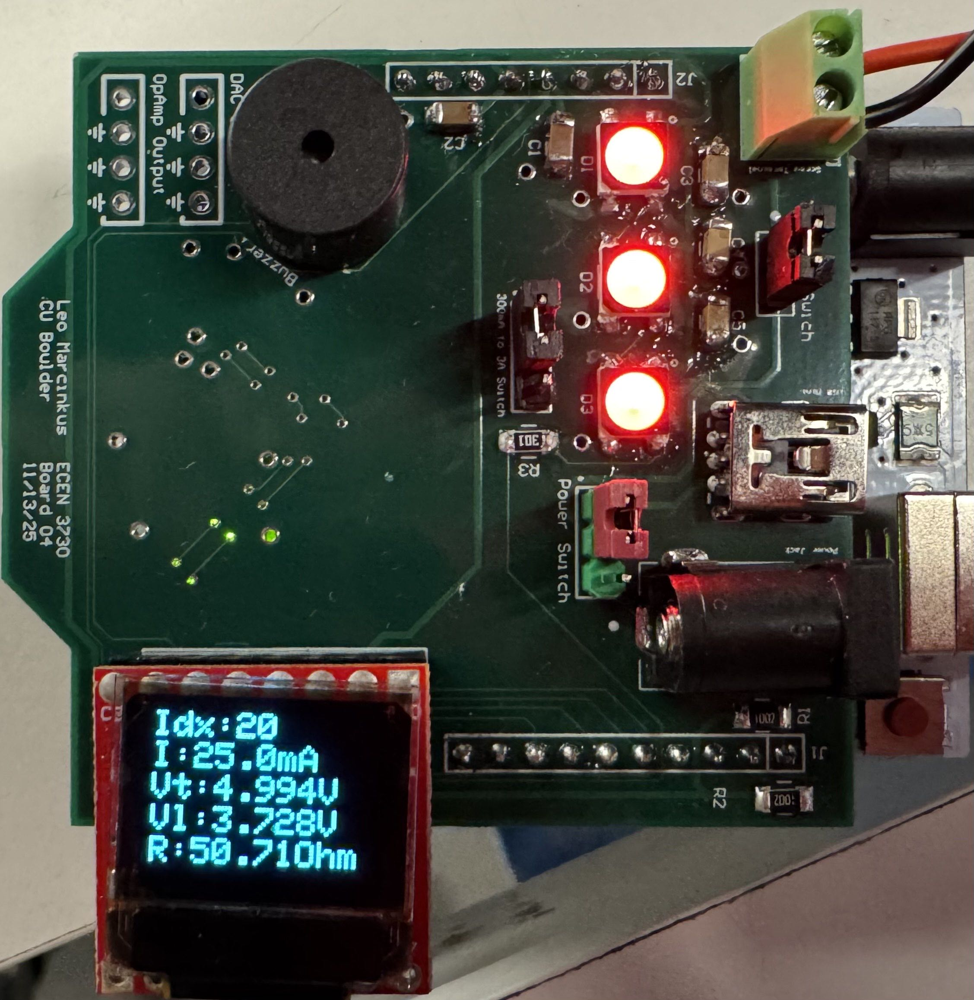

# Leo Marcinkus - Electrical Engineering Portfolio

This repository holds various curated engineering projects, lab reports,
and technical papers I've completed during my undergraduate and accelerated
master’s studies in Electrical Engineering here at the University of Colorado Boulder.

I primarily focus on hardware design, signal integrity, and
semiconductor devices, with a large emphasis on hands-on learning,
measurement analysis, and troubleshooting.

▶️ Download Resume (PDF)
📄 [Leo Marcinkus - Resume](Leo-Marcinkus-Resume.pdf)

---

# Featured Project

## :bulb: [Retro Glass Fuse Wireless Lamp – Battery-Powered ESP32 Lighting System](retro-fuse-lamp/)

  

A battery-powered embedded lighting system built using ESP32 microcontrollers
and wireless ESP-NOW communication. The system integrates Li-ion battery
charging, power regulation, and MOSFET LED switching into a compact hardware
prototype with wireless control.

This project combines embedded firmware development, power electronics design,
and wireless debugging while emphasizing power efficiency and safe battery
management.

📂 Project Folder  
`projects/retro-fuse-lamp/`

---

## More Featured Projects :star:

### :star: [Golden Arduino - Custom Arduino-Compatible Board](pcb-design/boards/board3/) 
**PCB Design, Altium, Embedded Hardware**

  

Designed and assembled a custom Arduino-compatible development board with
optimized power distribution, bootloader integration, and full IDE compatibility.  
`pcb-design/boards/board3-golden-arduino/`

---

### :star: [Instrument Droid - Measurement and Test Shield](pcb-design/boards/board4/)  
**Mixed-Signal Design, System Integration** 

  

Multi-function instrumentation shield integrating DAC, ADC, programmable load,
and OLED interface for Thevenin equivalent measurement and system validation.  
`pcb-design/boards/board4-instrument-droid/`

---

### :star:GAA Nanosheet FET Scaling Analysis  
**Semiconductor Devices, Research Analysis**  
Technical research paper analyzing gate-all-around nanosheet transistor
architectures for advanced CMOS scaling beyond FinFET technology.  
`semiconductor-devices/final-gaa-nanosheet-fet/`

---

### :star:STM32F429 Blackjack Touchscreen Game  
**Embedded Systems, C, HAL Drivers, Touch UI**  
Custom embedded application developed on the STM32F429DISC-1 platform featuring
a touchscreen-based Blackjack game, interrupt-driven input, and modular firmware
architecture.  
`embedded-systems/stm32f429-blackjack-touchscreen/`

---

## Project Areas

### PCB Design and Hardware
Multi-layer PCB design, fabrication, and validation projects emphasizing
signal integrity and power integrity.  
`pcb-design/`

### High-Speed Digital & Signal Integrity
Time- and frequency-domain analysis of interconnects, decoupling networks,
and multi-GHz digital systems.  
`high-speed-signal-integrity/`

### Semiconductor Devices
Device characterization experiments and research papers covering diodes,
MOSFETs, photonics, and advanced CMOS architectures.  
`semiconductor-devices/`

### Electromagnetics, Waves, and Fields
Applied electromagnetic modeling and simulation projects.  
`electromagnetics-waves-fields/`

### Embedded Systems
STM32 and microcontroller-based projects involving real-time firmware,
peripheral drivers, and user interfaces.  
`embedded-systems/`

---

## Tools and Technologies

- Programming: C/C++, Python, MATLab
- Embedded Platforms: STM32, Arduino, ARM Cortex-M  
- PCB Design: Altium Designer  
- Simulation: LTSpice, SIMetrix, Keysight ADS  
- Measurement: Oscilloscopes, SMUs, Logic Analyzers  
- Analysis: MATLAB, Python  

---

## Contact
  
- Email: leomarcinkus@gmail.com, leo.marcinkus@colorado.edu
- Phone: (630) 864-8802
- Handshake: https://boulder.joinhandshake.com/profiles/leomarcinkus
- GitHub: https://github.com/Leo-Marcinkus

---
